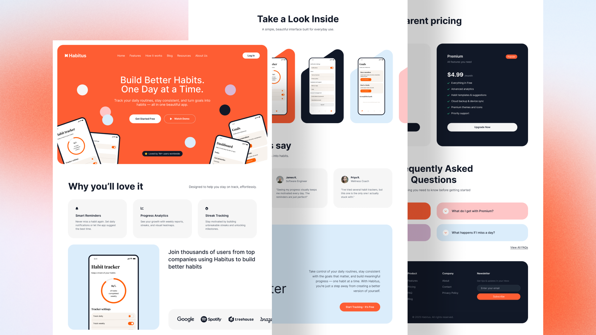
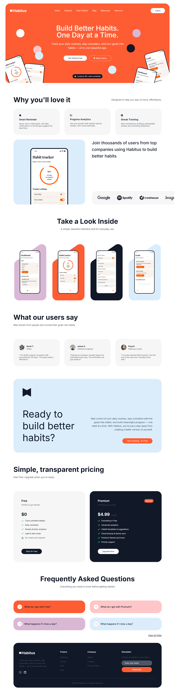

# Habit Tracker App Landing Page
Habit Tracker App Landing Page is a sleek, modern landing page template for habit-tracking and wellness apps. Built with semantic HTML and clean CSS, it’s perfect for startups, product demos, and portfolio showcases.


## 🔗 **Live Demo**: [View Online](https://javad2006sy.github.io/habit-tracker-app-landing/)

## Languages
[](https://skillicons.dev/)

## Overview


## 🎨 Figma File
figma file link: [Habitus – Habit Tracker App Landing Page](https://www.figma.com/community/file/1507106587522840897)


## Table of Contents
- [Features](#features)
- [Quick Setup](#quick-setup)
- [Project Structure](#project-structure)
- [Contributing](#contributing)
- [Style Guide](#style-guide)
- [Customization](#customization)
- [Current Version Overview](#current-version-overview)
- [To Do List](#to-do-list)


## Features

#### 🎨 Pixel-perfect Figma-to-code implementation
#### ⚡ Lightweight, no frameworks — pure HTML/CSS
#### 📂 Organized folder structure for scalability
#### 💡 Easy customization with CSS variables


## Quick Setup
Clone this [repository](https://github.com/Javad2006sy/habit-tracker-app-landing) by running this command in terminal:

```terminal
git clone https://github.com/Javad2006sy/habit-tracker-app-landing.git
```

Then navigate to project folder:

```terminal
cd habit-tracker-app-landing
```

Or you can directly download project source: [download](https://github.com/Javad2006sy/habit-tracker-app-landing/archive/refs/heads/main.zip)


## Project Structure

```
habit-tracker-app-landing/
├── assets/                    
│   ├── fonts/                    # project fonts
│   ├── icons/                    # project svg icons
│   └── images/                   # project images
├── css/
│   ├── base/                     # basic styles
│   │   ├── fonts.css               # @font-face declarations
│   │   ├── reset.css               # reset default elements styles and behaviors
│   │   ├── typography.css          # typography declarations and utilities
│   │   └── variables.css           # css variables(colors, fonts, etc.)
│   ├── components/               # UI components
│   │   ├── button.css              # button component styles
│   │   ├── float-circle.css        # floating circles in hero section
│   │   ├── accordion.css           # accordions in FAQ
│   │   ├── feature-list.css        # pricing table list
│   │   ├── icon-box.css            # icon box component styles
│   │   ├── image-box.css           # image box component styles
│   │   ├── price-table.css         # price table in pricing section
│   │   └── testimonial.css         # testimonial boxes
│   ├── layout/                   # page layout styles
│   │   ├── flex.css                # flex layout and utilities
│   │   ├── header.css              # header styles
│   │   └── footer.css              # footer styles
│   └── main.css                  # main styles
├── index.html                  # page entry point
└── README.md                   # this file
```

## Contributing
Contributions are welcome!  
Feel free to open an issue or submit a pull request.


## Style Guide

### Colors
- White: `#FFF`
- Orange: `#FE5D33`
- Light Blue: `#DBEDFB`
- Light Purple: `#D9B8D5`
- Pink: `#FEC6C7`
- Light Grey: `#F6F6F6`
- Dark: `#111827`
- Grey Text: `#4B5563`

### Typography

- Font Family: `Inter`
- Font Weights:
  - Light: `300`
  - Regular: `400`
  - Medium: `500`
  - SemiBold: `600`
  - Bold: `700`
- Base Font Size: `1rem` or `16px`
- Base Font Weight: `400`


## Customization
You can customize colors in `css/base/variables.css`:

```css
:root {

    /* Colors */
    --color-white: #FFF;
    --color-orange: #FE5D33;
    --color-light-blue: #DBEDFB;
    --color-light-purple: #D9B8D5;
    --color-pink: #FEC6C7;
    --color-light-grey: #F6F6F6;
    --color-dark: #111827;
    --color-grey-text: #4B5563;
}
```

You can also customize font variables in this file:

```css
:root {
    /* Typography */
    --font-family-base: 'Inter', tahoma, verdana, sans-serif;
    --font-size-base: 1rem;
    --font-size-level-1: 3.75rem;
    --font-size-level-2: 1.25rem;
    --font-size-level-3: 1rem;
    --font-size-btn: 1rem;
    --font-weight-base: 400;
    --font-weight-level-1: 700;
    --font-weight-level-2: 300;
    --font-weight-level-3: 400;
    --font-weight-btn: 600;
    --font-line-height: 1.6em;
}
```

## Current Version Overview
Here is a full page screenshot



> [!NOTE]
> I made a few small changes to make the design look better.


## To Do List
- [ ] Responsive for tablet devices
- [ ] Responsive for mobile devices
- [ ] Refactor & optimize code